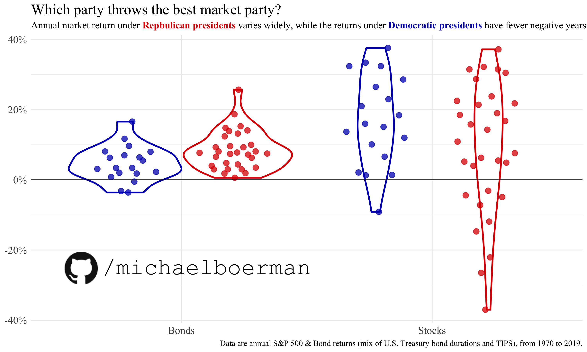

# political_party_returns
 Simple plots showing returns for stocks and bonds for each presidential party over 50 years.
 
 Just a pet project to showcase my code. For an extensive project, including data collection, prep, statistical analysis, and complex plotting, see my [COVID Lockdown Severity Index!](https://github.com/michaelboerman/lockdown_severity_index#readme)
 
 Data and discussion from [Jacob Stephens](https://jacobcstephens.com/about/). 
 
 

